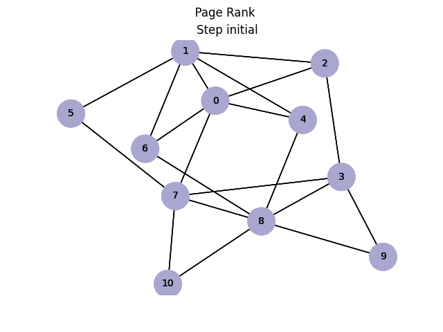

# LA_project_GooglePageRank
Implementation of Google PageRank algorithm for the LA course
## Contributors
 - [Sofiia Myntiuk](https://github.com/sophmintaii)
 - [Daryna Hnatenko](https://github.com/monberin)
 - [Valeriia Sydorenko](https://github.com/lero4kaa)

## Prerequisites
```bash
pip install numpy
pip install pandas
pip install networkx
pip install matplotlob
```
## Usage
two csv files are needed: one with adjacency lists for nodes, and one with nodes and their names
```
python3 main.py <file_adjacency_lists> <file_node_name>
```
## Data
[data used in the example](https://www.kaggle.com/flashgordon/usa-airport-dataset)

## Results


(running on the smaller dataset for prettier graphs)
regular power method:


adaptive power method:

